# 💻 CRM (Customer Relationship Management) Programı

▶️ Proje Açıklaması
Bu proje, müşteri ilişkilerini yönetmek için geliştirilebilir temel bir CRM (Customer Relationship Management) programıdır. Bu yazılım, müşteri bilgilerini toplamak, düzenlemek ve analiz etmek için çeşitli araçlar sunarak işletmelerin müşteri ilişkilerini daha etkili bir şekilde yönetmelerine yardımcı olur. Bu projede MySQL veritabanı kullanılmış olup, kodlar MySQL bağlantılarını içermektedir.

▶️ Project Description
This project is a basic, customizable CRM (Customer Relationship Management) program for managing customer relationships. This software helps businesses manage customer relationships more effectively by providing various tools to collect, organize, and analyze customer information. This project uses a MySQL database, and the code includes MySQL connection scripts.

## Özellikler
🔶 **Giriş Sayfası**: Kullanıcı adına özel giriş.

🔷 **Login Page**: Personalized login for users.

    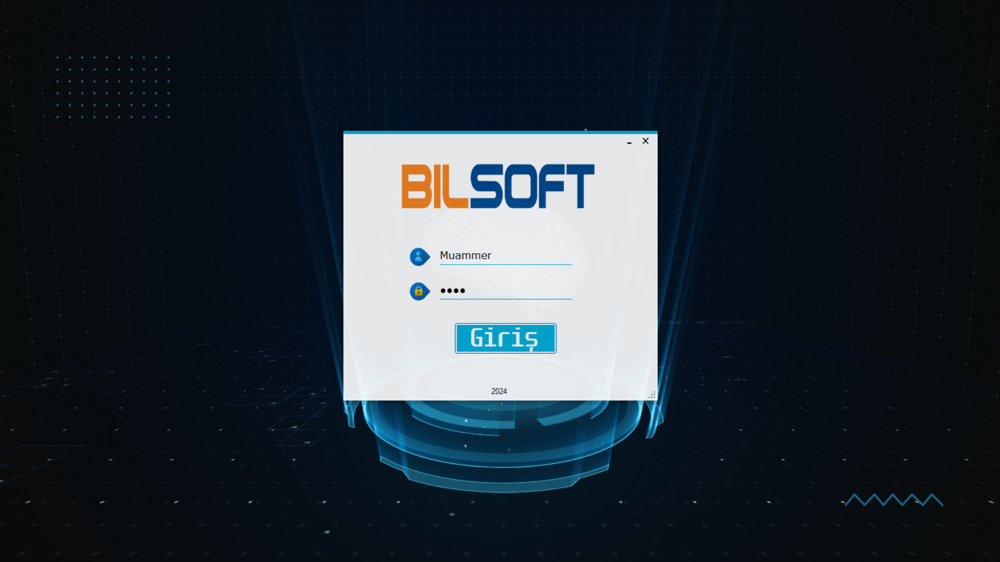

🔶 **Ana Sayfa**: Kullanıcı başarılı bir şekilde giriş yaparsa, giriş ekranından sonra bu ekran açılır. Bu ana sayfa her kullanıcı için özelleştirilebilir.

🔷 **Home Page**: If the user successfully logs in, this screen opens after the login page. This home page can be customized for each user.

    

🔶 **Özelleştirme Formu**: Bu form, programın sağ alt köşesindeki + butonuna tıklayarak, ana sayfada görünmesini istediğiniz formları seçmenizi ve bu seçimleri kullanıcı adına kaydetmenizi sağlar.

🔷 **Customization Form**: This form allows you to click the + button located at the bottom right of the program to select which forms you want to display on the home page and save these selections under the user's name.

    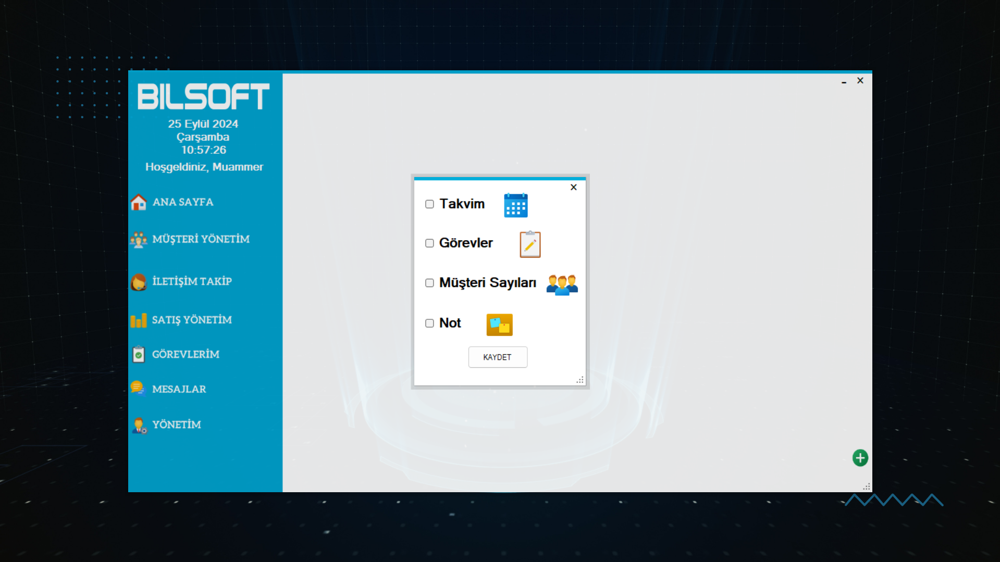
    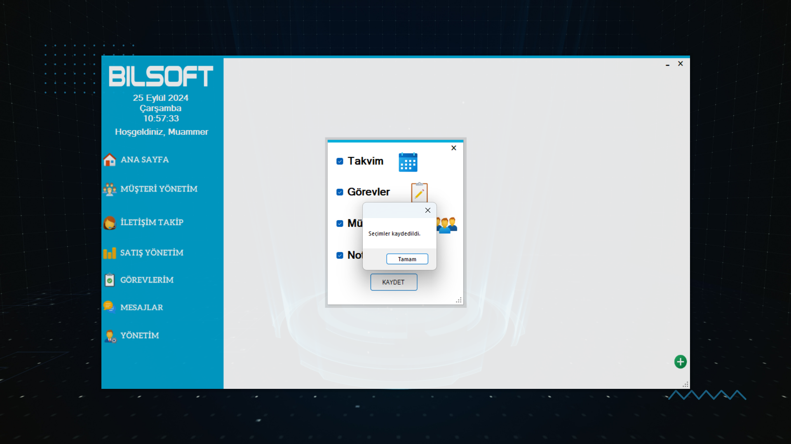

🔶 **Kişisel AnaSayfa**: Kullanıcı, kendi ihtiyaçlarına uygun özelleştirilmiş menüleri açabilir. Bu menüler şunlardır:

🔴Takvim: Kullanıcı, tarih öğrenmek veya bir tarih hakkında not almak için kullanabilir.
🔴Görevlerim: Yönetici tarafından verilen görevler, ana sayfada 'Görevlerim' paneline düşer.
🔴Müşteriler: Son eklenen müşteriler sırasıyla görüntülenir.
🔴Notlarım: Her kullanıcı, kendi özel notlarını burada tutup kaydedebilir.

🔷 **Personal HomePage"**: The user can open customized menus necessary for their own use. These menus include:

🔵Calendar: The user can use this to learn a date or take notes about a date.
🔵My Tasks: Tasks assigned by the administrator will appear in the 'My Tasks' panel on the home page.
🔵Customers: The most recently added customers will be displayed in order.
🔵My Notes: Each user can keep and save their personal notes here.

    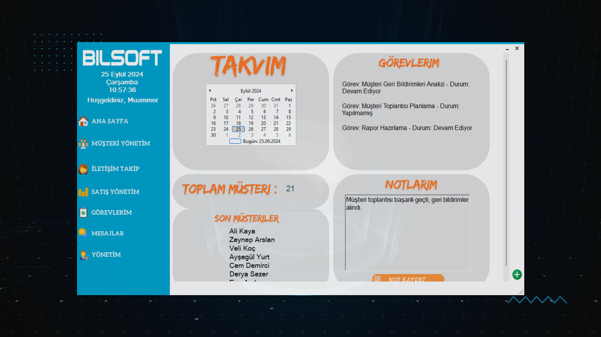

🔶 **Müşteri Yönetim**: Eklenen müşteriler bu ekranda listelenir ve kullanıcı, müşteriler üzerinde silme ve düzenleme işlemleri gerçekleştirebilir. Ayrıca, müşteri detayları hakkında bilgi alabilir ve detay ekleyip silebilir.

🔷 **Customer Management**: The added customers are listed on this screen, and the user can perform delete and edit operations on them. Additionally, they can obtain information about customer details and add or delete details as needed.

    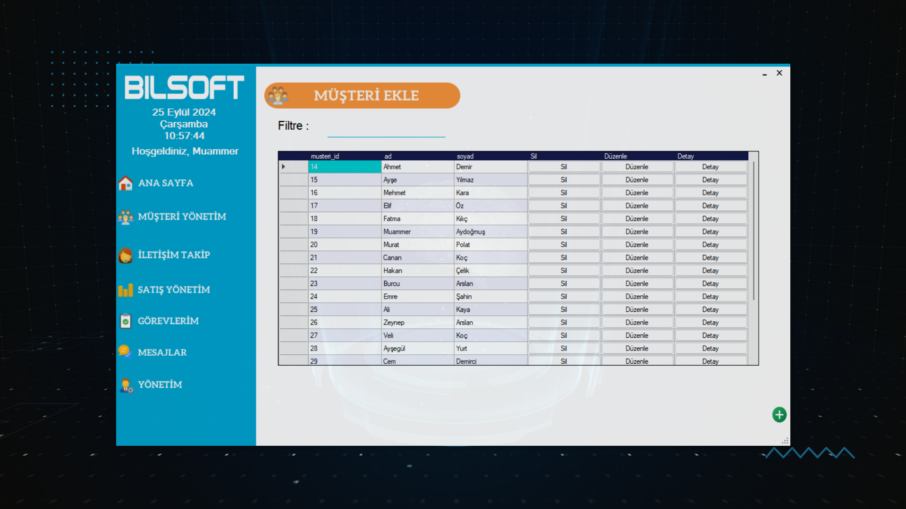
    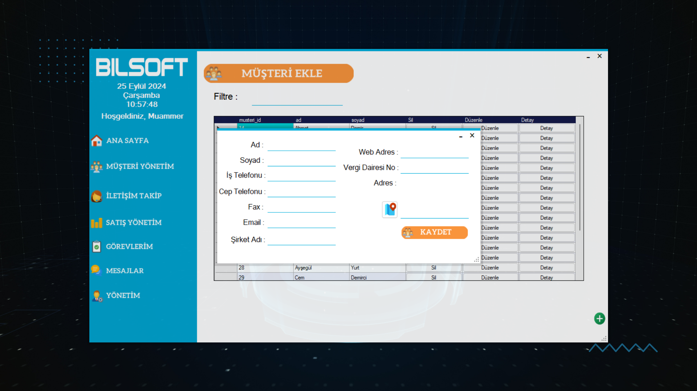

🔶 **Google Harita Entegrasyonu**: Müşteri ekleme formundaki adres kutusunun yanındaki butona tıklayarak harita açılır. Açılan haritada kullanıcı kendi konumunu seçip bu konuma çift tıkladığında bir onay ekranı görüntülenir. Eğer konum yanlışsa, kullanıcı tekrar konumunu seçebilir; eğer doğruysa, bu konum adres kutusuna aktarılır.

🔷 **Google Maps Integration**: By clicking the button next to the address field in the customer addition form, a map opens. On the map, the user can select their location and double-click on it to bring up a confirmation screen. If the location is incorrect, the user can reselect it; if correct, the location is transferred to the address field.

    
    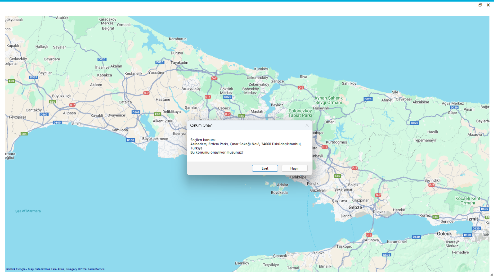

🔶 **İletişim Yönetim**: Kullanıcılar, müşterilerle yaptığı iletişimi buraya not olarak kaydeder. Kullanıcı, iletişim kurduğu müşteriyi seçer, iletişim yolunu belirler ve iletişimin detayını girerek kaydeder.

🔷 **Communication Management**: Users record their communications with customers as notes here. The user selects the customer they have communicated with, chooses the communication method, and enters the details of the communication to save it.

    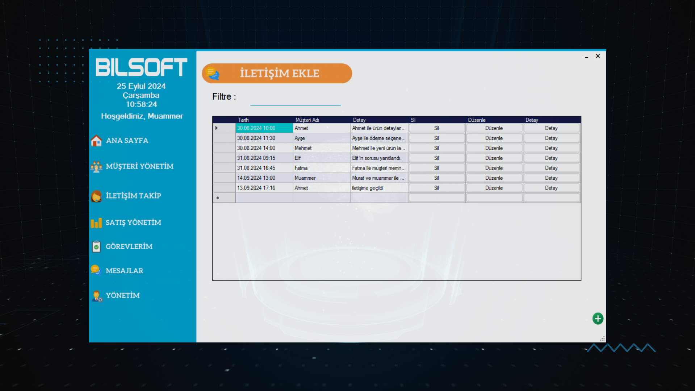
    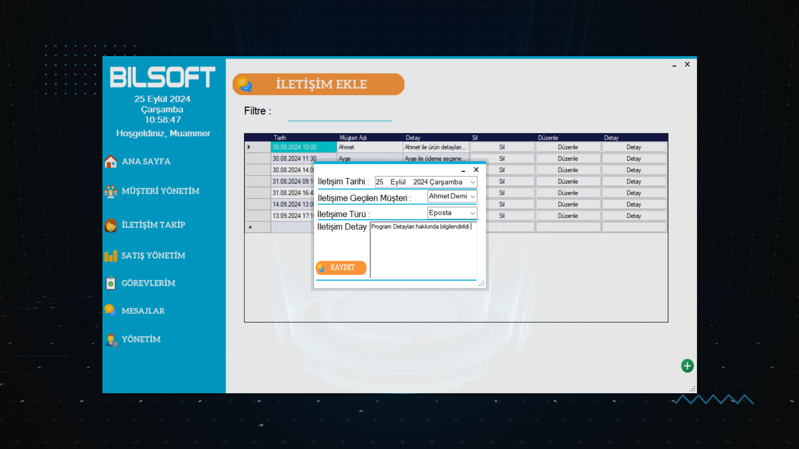

🔶 **Satış Yönetimi**: Bu ekranda kullanıcı fırsat ekleyebilir, bu fırsatları düzenleyebilir ve silebilir; ayrıca bu fırsatların detaylarını görebilir.

🔷 **Sales Management**: On this screen, the user can add opportunities, edit and delete these opportunities, and view the details of these opportunities.

    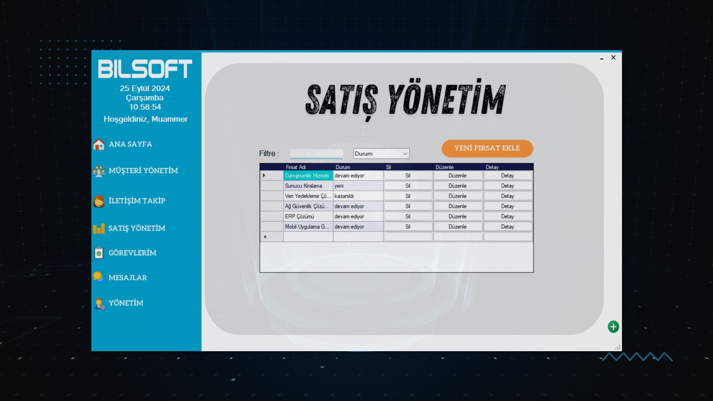
    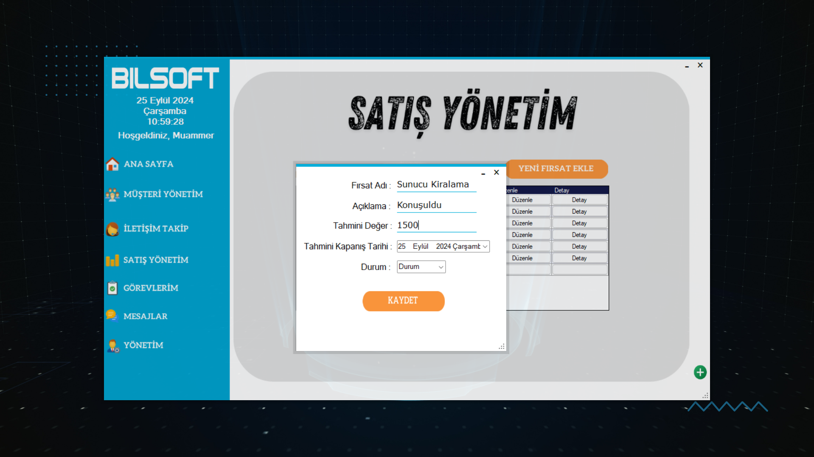

🔶 **Görevlerim**: Görevlerim ekranında kullanıcılar, yönetici tarafından kendilerine verilen görevleri görebilir ve bu görevlerin durumunu 'Tamamlanmış', 'Devam Ediyor' veya 'Yapılmamış' olarak güncelleyebilirler.

🔷 **My Tasks**: On the My Tasks screen, users can see the tasks assigned to them by the administrator and can update the status of these tasks as 'Completed,' 'In Progress,' or 'Not Started.

    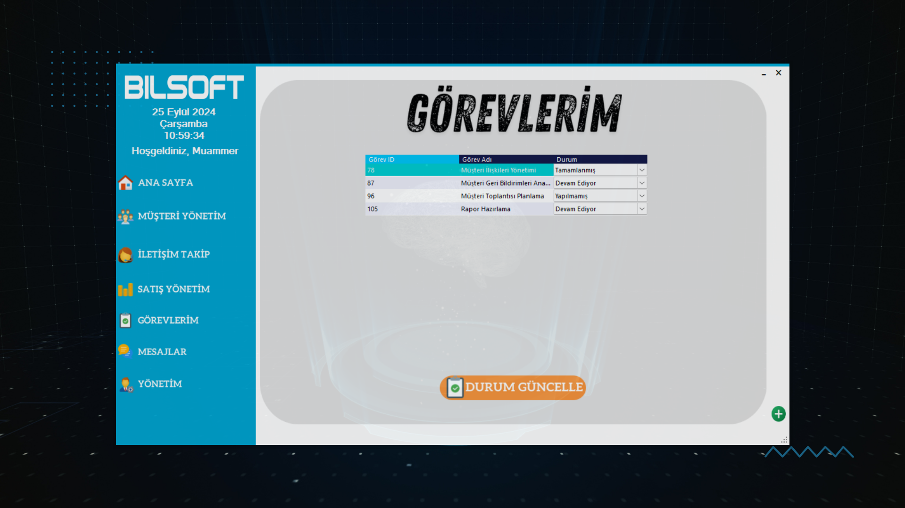

🔶 **Mesajlar**: Mesajlaşma kısmında kullanıcılar, program içinden birbirleriyle iletişim kurabilirler.

🔷 **Messages**: In the messaging section, users can communicate with each other within the program.

    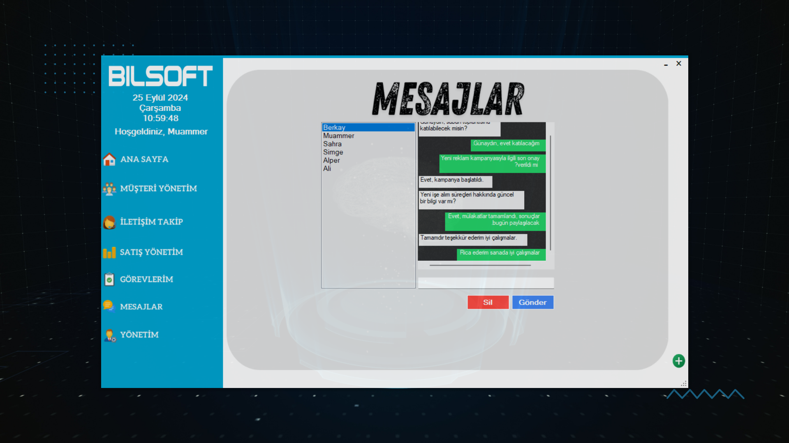

🔶 **Yönetim**: Yönetim paneline yalnızca yönetici rolündeki kullanıcılar erişim sağlayabilir. Bu ekranda, kullanıcı ekleyip listeleyebilir, kullanıcılara görev verebilir ve tüm görevleri listeleyebilir; ayrıca müşteri bilgilerini rapor şeklinde alabiliriz.

🔷 **Management**: Only users with the administrator role can access the management panel. On this screen, users can add and list other users, assign tasks to users, and list all tasks; they can also obtain customer information in the form of reports.

    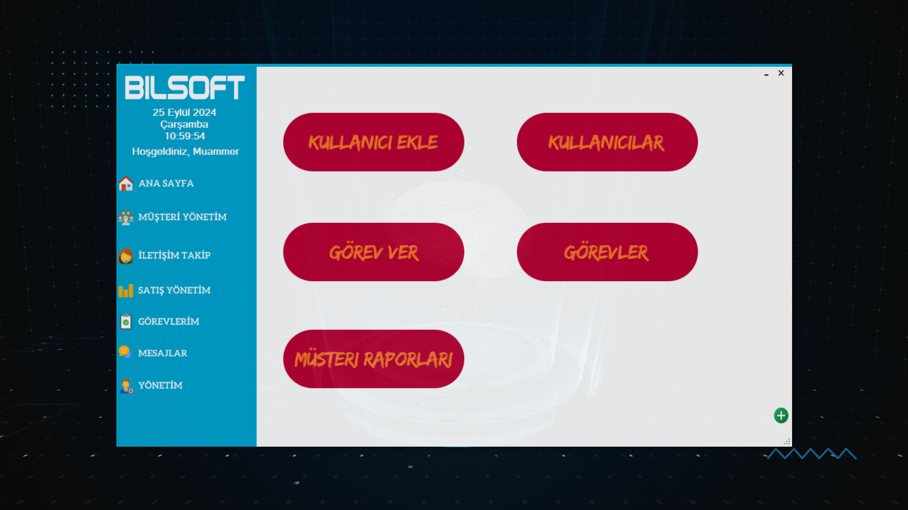

🔶 **Kullanıcı Ekleme & Listeleme**: Kullanıcı ekleyip bu kullanıcıya rol ve şifre verebiliriz, ayrıca bu kullanıcıların tümünü listeleyebiliriz.

🔷 **User Addition & Listing**: We can add users and assign roles and passwords to them, and we can also list all these users.

    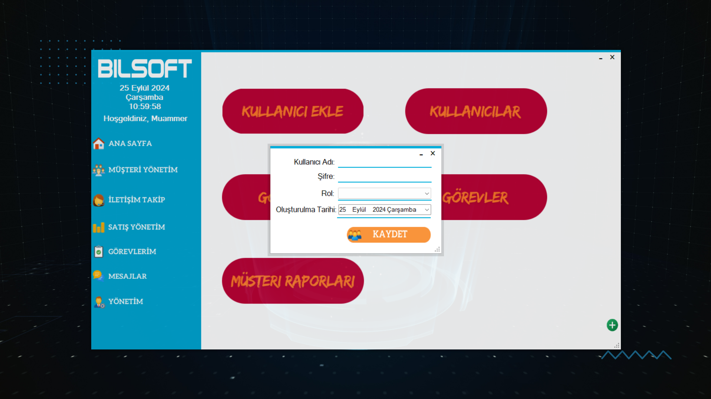
    

🔶 **Görev Verme & Listeleme**: Kullanıcı ekleyip bu kullanıcıya rol ve şifre verebiliriz, ayrıca bu kullanıcıların tümünü listeleyebiliriz.

🔷 **Task Assignment & Listing**: We can add users and assign roles and passwords to them, and we can also list all these users.

    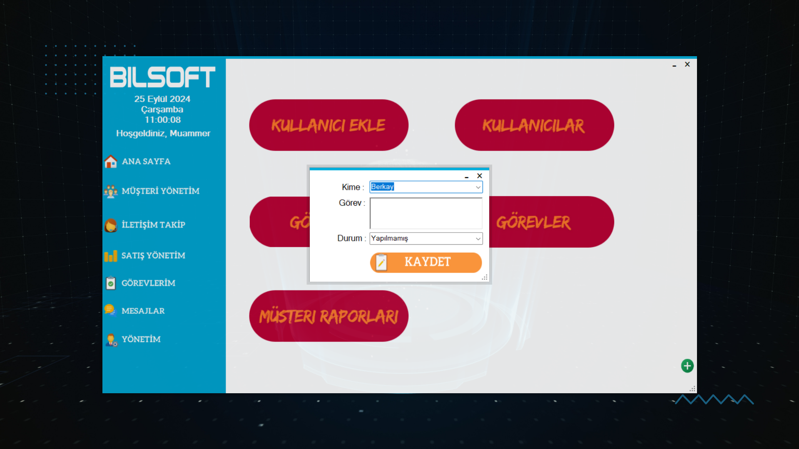
    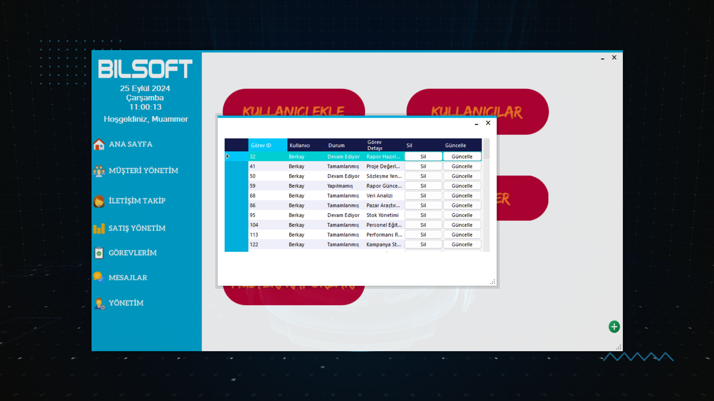

🔶 **Raporlama**: Yönetim panelindeki müşteri raporları kısmına tıkladığımızda, FastReport sayesinde tüm müşteri listesini tasarlayacağımız rapora göre düzenleyip sunuyor.

🔷 **Reporting**: When we click on the customer reports section in the management panel, it provides us with the entire customer list organized according to the report we will design using FastReport.

    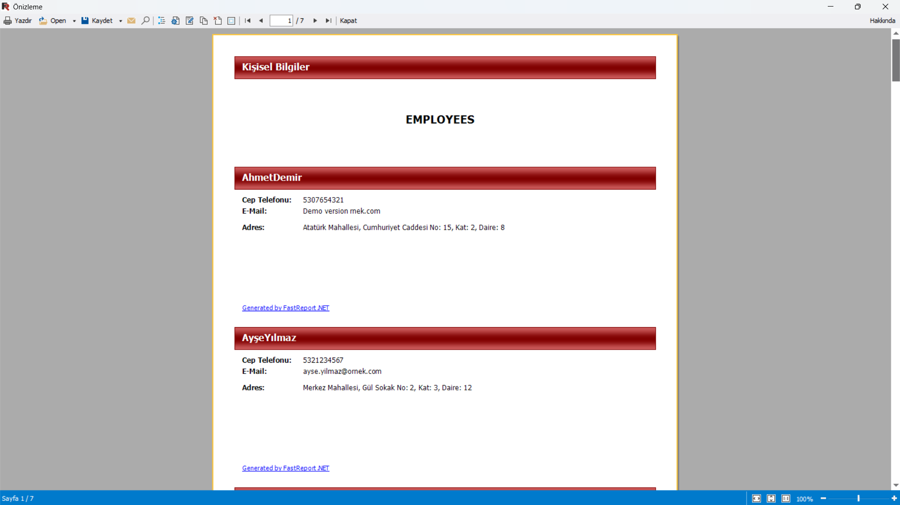

